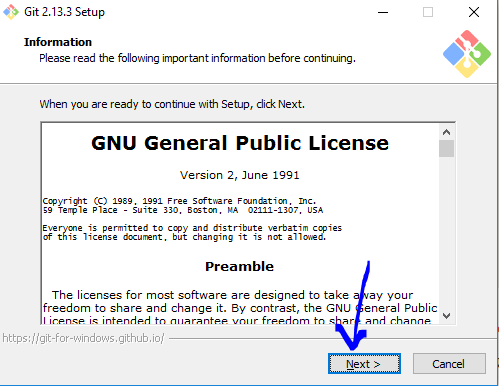
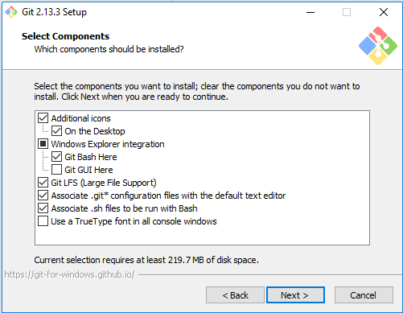
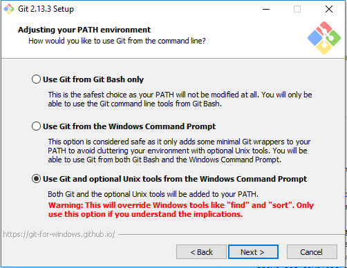
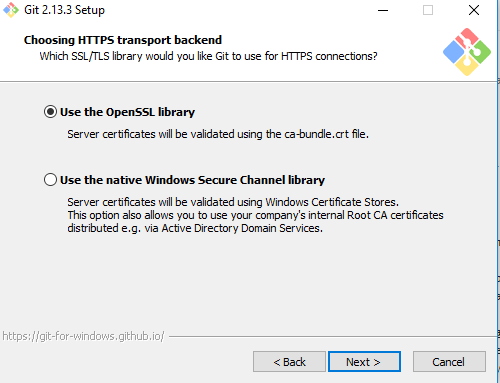
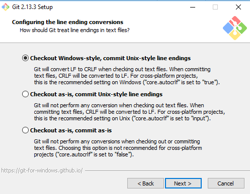
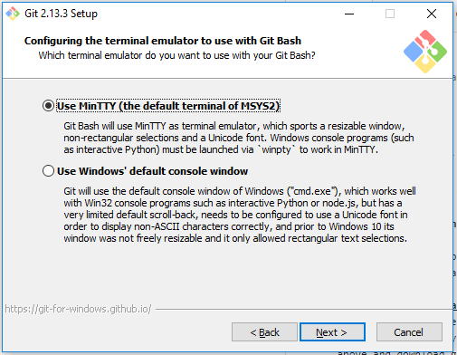
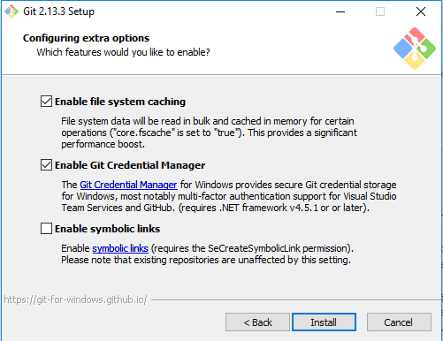
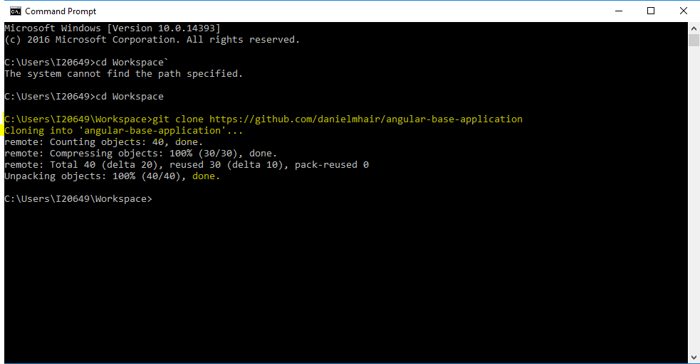

After Session 1 - Setup
=======================

As a recap, you have went through all the necessary videos from `Udemy`'s Course about Web Developement from the teacher `Rob Percival` (as shown below):
- Section 1: HTML
- Section 2: CSS
- Section 3: Javascript

Now you are ready to start coding in HTML, CSS and JavaScript. You have been exposed to these languages, but it only makes sense when you start using them and understand the concepts of programming as you code in these languages. Before doing this though, we need to go over some basics of tools that programmers always use. One of the main tools we will use is GitHub. To use GitHub most effectively, you will need to know how to use the command line.

## Overview:
- Get familiar with the command line
- Copy the code in this repo
- Install NodeJS
- Install Yarn
- Install libraries for the app
- Run the app

### Step 1 - Get familiar with the command line
I'm not sure whether you are familiar with the command line or not. If not, here is picture of it and details about it. You might already know about it. In this case, ignore this heading and skip to the heading called `Copy code in this repo angular-base-application` below.


If you were into computers when the first windows came out, this was what a computer was (DOS). DOS (the command line) is still used by IT and CS people on a daily basis. Don't be afraid of the command line. Many people, especially those using it for the first time, always say they are afraid that they are going to ruin the computer. There is really only one command that can do that, which is `rm -rf *`. Trust me, you don't ever want to do this, this will literally wipe your hard drive. lol. As long as you don't run that command, then your good! Now that the fear is gone, lets begin! Haha.

The command line has many names: Command line, `DOS`, `Command Prompt` (search `cmd` to find the `Command Prompt` in Windows), the `Terminal` (search `Terminal` to find it in MAC). So whenever I say "command line", I mean "Terminal", "DOS", "Command Prompt", etc. These are all basically the same thing. Another way to think about it is that the command line is that "black thingy that makes you look like a programmer" ;) Be aware that the `Command Prompt` in Windows uses different commands than the `Terminal` in MAC, but they do the same thing, like `cd` in MAC and `dir` in Windows both change directories.

One thing you will do a lot is navigate through your folders on your computer in the command line. If you look at the image above, you will notice it says `C:\Users\Mrhope`. If you go to your `Windows Explorer` in Windows, you can find this folder. In MAC, it would look like `jim`. This would mean you are in the `jim` folder. With the `Finder` in MAC, you can find this folder as well. Below is what you might see in MAC:
<br/><br/>

Just think of the command line as a different navigator with more powers!

Here are a few commands:
- `cd your-folder-name` changes directories from where your at. So if I am in `C:\Users\danielmhair` and run that command, then I will be in `C:\Users\danielmhair\your-folder-name`. As I said, running `dir your-folder-name` will do the same in windows.
- `mkdir new-folder` will allow you to make a new folder in the directory you are in.
- `rm -rf <folder-path>` will allow you to remove recursively and forcefully the folder you replace `<folder-path>` with. The `r` after the `-` is an option meaning recursively, then the `f` means `force`. Options are used like a list. So anything after the `-` and before the space (in our case `-rf`) will be all the options you want to apply to the command (the command here is `rm`). Force, in this case, basically doesn't care about the file being write protected. This is why the evil and "off-limits" command `rm -rf *` means remove everything recursively and do not care about write-protected files. You may not know what I mean by write-protected. Write-protected, means that you can't edit the file. Also, I keep saying recursively. Recursively means to repeat, so it will go through all the files and folders within this folder and remove them. If there are folders within folders, it will keep repeating this for all subfolders. So you will be wiping out that entire folder, along with its subfolders and files. So that `*` in `rm -rf *` is a wildcard, so it means everything. This is why its off-limits (and I don't know why they don't safeguard against that command lol --- stupid programmers).

Moving on! I suggest making a folder where all your programming apps go into. I usually have a folder called `C:\Users\danielmhair\Workspace`.

In windows:
```
dir "C:\Users\<username>"
mkdir Workspace
dir Workspace
```

Or in MAC's Terminal, run:
```
cd "C:\Users\<username>
mkdir Workspace
cd Workspace
```
Replace `<username>` with your username, of course.

I know you can do this in `Finder` or `Windows Explorer`, but do it in the command line for practice.

There will be a lot of other commands, but this will at least help you get familiar with the command line.

MAC is a linux-based operating system and `cd` is from linux. Windows uses `dir`, because Windows does not use a linux-based operating system. its not linux. However, there are ways to use Linux-based commands in Windows, which is what we will do next. I suggest doing this, because all of the information online will use linux-based commands, not Windows (programmers love Linux -- I just love the commands from Linux, but use Windows as my operating system).

### Step 2 - Copy the code in this repo `angular-base-application`

Now that you know about the command line, you now know there are multiple kinds of command lines. We have `Command Prompt` for Windows, `Terminal` for MAC and others.

#### Step 2a - Install [Git Bash](https://git-scm.com/downloads)
We are going to have you install another command line called `Git Bash`. This allows you to use commands from `GitHub` in order to update a repo with your new code, copy code from a repo (which is what you are going to do now), and other things. Click on the link above and download `git bash`. Below are images showing what options to put when installing it.
<br />
<br />
<br />
<br />
You might notice that the next step is telling git bash to add linux commands to the command line. This will add all the features of git bash in the Command Prompt and let you run `git` (`GitHub`) commands. The other addition linux commands means that instead of using `dir` to change directories, you can use what MAC uses, `cd`! Now changing from MAC to Windows will not be much different for you. <br /><br />
<br />
<br />
<br />
<br />
<br />

Open the command line (be sure to restart the command line after installing `git bash`).

```
cd <the-path-to-your-programming-directory>
git clone https://www.github.com/danielmhair/angular-base-application.git
cd angular-base-application
```

Here is a screenshot when I did this:


You now have the code copied to your computer in the folder `angular-base-application`.

### Step 3 - Install [NodeJS](https://nodejs.org/en/download/)
Click on the link "NodeJS" above. Select the operating system and then run the installer it downloads.

### Step 4 - Install [Yarn](https://yarnpkg.com/lang/en/docs/install/)
Make sure to install `Yarn` after you install `NodeJS` because `Yarn` uses `NodeJS` to install things. `Yarn` is a package manager. Click on the link and there is a button on the screen that says "Download Installer". Download it and install `Yarn` that way.

### Step 5 - Install Libraries for this application
Now that you have `NodeJS` and `Yarn` installed, you can now setup your application. Before, you are use to running your webpage by opening the `html` file. We now have an automated way that will open it for you and reload the page whenever you make changes to your files. Run the command below to prepare your app (you only need to do this once):

```
yarn install
```

### Step 6 - Run the app
Now that you have installed the libraries you need, in `VS Code` go to the `Debug` menu. Click on `Start without debugging`. This will run your app.