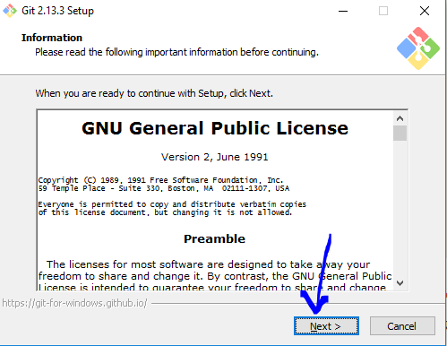
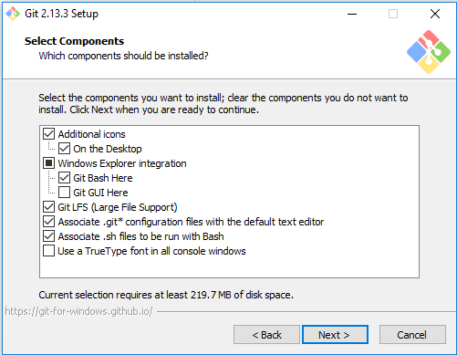
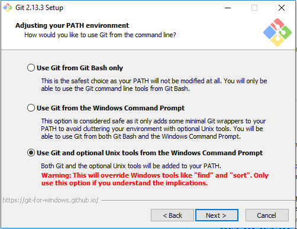
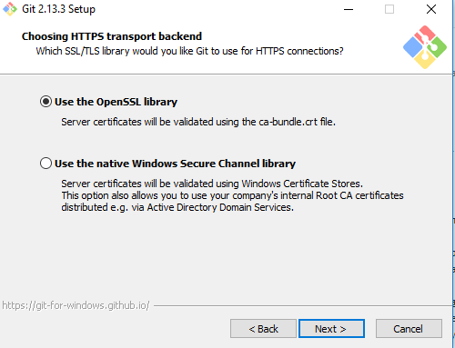
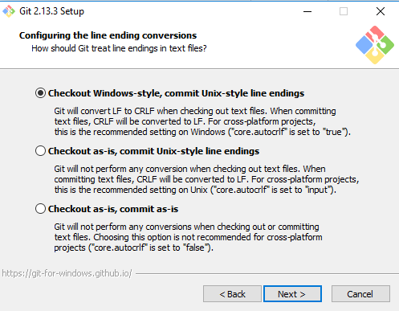
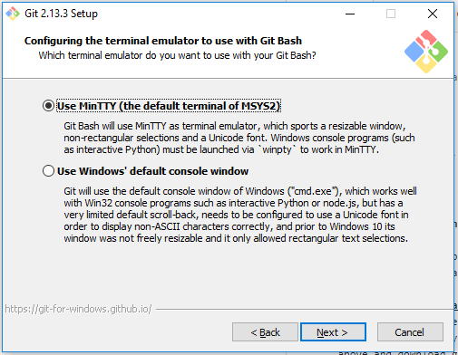
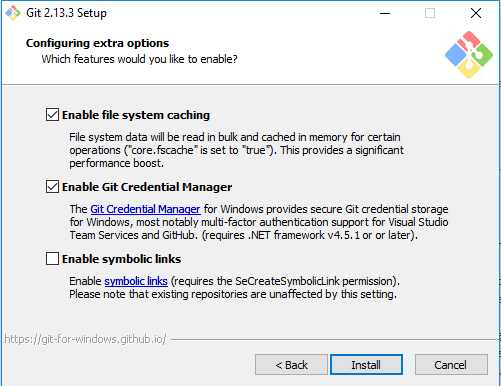
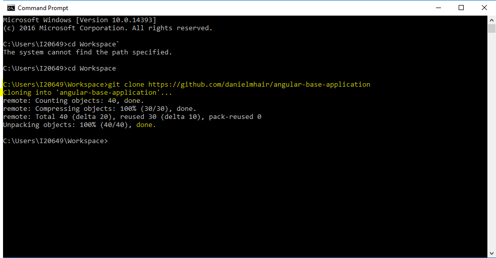

Setting up computer for Programming Session 1
=============================================

As a recap, you have went through all the necessary videos from `Udemy`'s Course about Web Developement from the teacher `Rob Percival` (as shown below):
- Section 1: HTML
- Section 2: CSS
- Section 3: Javascript

Now you are ready to start coding in HTML, CSS and JavaScript. You have been exposed to these languages, but it only makes sense when you start using them and understand the concepts of programming.

Throughout all the sessions, I am going to highlight an action item with bolded text and other things. An example is as follows:

**Action Item**
```
Code will be here or images or something else
```

### Get familiar with the command line
I'm not sure how familiar you are with the command line. Here is picture just in case:


If you were into computers when the first windows came out, this was what a computer was (DOS). DOS (the command line) is still used by IT and CS people on a daily basis. I wanted to have an introduction with you about these things so you were aware of it. You might already know about it. In this case, ignore this head and skip to "Copy code in this repo".

Don't be afraid of the command line. Many people, especially using it for the first time always say they are afraid that they are going to ruin your computer. There is really only one command that can do that with `rm -rf *`. Trust me, you don't ever want to do this, this will literally wipe your hard drive. lol. As long as you don't run that command, then your good!

The command line has many names: Command line, DOS, Command Prompt (search this to find it in windows), the "Terminal" (search this to find it in MAC). Command Prompt has different commands than the Terminal. So whenever I say command line, I mean "Terminal", "DOS", "Command Prompt", etc. These are all the same name. Another way to think about it is that the command line is that "black thingy that makes you look like a programmer" ;)

One thing you will do a lot is navigate through your folders on your computer in the command line. If you look at the image above, you will notice it says `C:\Users\Mrhope`. If you go to your `Windows Explorer` in Windows or `Finder` in MAC, you can find this folder. Just think of the command line as a different navigator with more powers.

Here are a few commands:
- `cd your-folder-name` changes directories from where your at. So if I am in `C:\Users\danielmhair` and run that command, then I will be in `C:\Users\danielmhair\your-folder-name`.
- `mkdir new-folder` will allow you to make a new folder in the directory you are in.
- `rm -rf <folder-path>` will allow you to remove recursively and forcefully the folder you replace `<folder-path>` with. The `r` after the `-` is an option meaning recursively, then the `f` means `force`. Options are used like a list. So anything after the `-` and before the space will be all the options you want to apply to the command. Force, in this case, basically doesn't care about the file being write protected. This is why the evil and "off-limits" command `rm -rf *` means remove everything recursively and do not care about write-protected files. You may not know what I mean by write-protected. Write-protected, means that you can't edit the file. Also, I keep saying recursively. Recursively means to repeat, so it will go through all the files and folders within this folder and remove this. If there are folders within folders, it will keep repeating this removal for all subfolders. So you will be wiping out that entire folder, along with its subfolders and files. So that `*` in `rm -rf *` is a wildcard, so it means everything. This is why its off-limits.

Moving on! I suggest making a folder where all your programming apps go into. I usually have a folder called `C:\Users\danielmhair\Workspace`.

**Action Item**
In windows:
```
dir "C:\Users\<username>
mkdir Workspace
dir Workspace
```

Or in MAC's Terminal, run:
```
cd "C:\Users\<username>
mkdir Workspace
cd Workspace
```

Replace `<username>` with your username, of course.

There will be a lot of other commands, but this will at least help you get familiar with the command line.

MAC is a linux-based operating system and `cd` is from linux. Windows uses `dir`, because its not linux. However, there are ways to use Linux-based commands, which is what we will do next. I suggest doing this, because all of the information online will use linux-based commands, not Windows (programmers love Linux -- I just love the commands from Linux, but use Windows as my operating system).

### Copy the code in this repo `angular-base-application`

Now that you know about the command line, you now know there are multiple kinds of command lines. We have `Command Prompt` for Windows, `Terminal` for MAC and others.

#### Install [Git Bash](https://git-scm.com/downloads)
We are going to have you install another command line called `Git Bash`. This allows you to use commands from `GitHub` in order to update a repo with your new code, copy code from a repo (which is what you are going to do now), and other things. Click on the link above and download git bash. Below are images showing what options to put when installing it.

**Action Items**<br />
<br />
<br />
You might notice that the next step is telling git bash to add linux commands to the command line. This will add all the features of git bash in the Command Prompt and let you run `git` (`GitHub`) commands. The other addition linux commands means that instead of using `dir` to change directories, you can use what MAC uses, `cd`! Now changing from MAC to Windows will not be much different for you. <br />
<br />
<br />
<br />
<br />
<br />

Open the command line (be sure to restart the command line after installing `git bash`).

**Action Item**
```
cd <the-path-to-your-programming-directory>
git clone https://www.github.com/danielmhair/angular-base-application.git
cd angular-base-application
```

Here is a screenshot when I did this:

